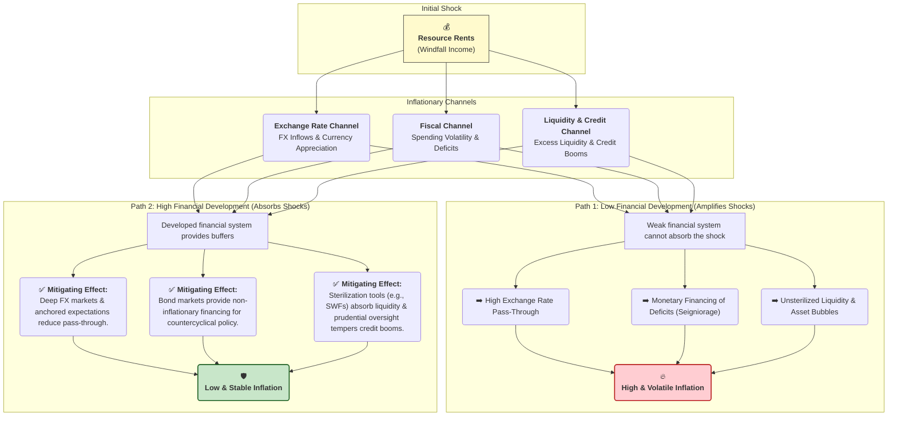

```mermaid
graph TD
    subgraph "Initial Shock"
        A["💰<br><b>Resource Rents</b><br>(Windfall Income)"]
    end

    subgraph "Inflationary Channels"
        B1("<b>Exchange Rate Channel</b><br>FX Inflows & Currency Appreciation")
        B2("<b>Fiscal Channel</b><br>Spending Volatility & Deficits")
        B3("<b>Liquidity & Credit Channel</b><br>Excess Liquidity & Credit Booms")
    end

    subgraph "Path 1: Low Financial Development (Amplifies Shocks)"
        C1["Weak financial system cannot absorb the shock"]
        D1("➡️ High Exchange Rate Pass-Through")
        D2("➡️ Monetary Financing of Deficits (Seigniorage)")
        D3("➡️ Unsterilized Liquidity & Asset Bubbles")
        E1("🔥<br><b>High & Volatile Inflation</b>")
    end

    subgraph "Path 2: High Financial Development (Absorbs Shocks)"
        C2["Developed financial system provides buffers"]
        F1("✅ <b>Mitigating Effect:</b><br>Deep FX markets & anchored expectations reduce pass-through.")
        F2("✅ <b>Mitigating Effect:</b><br>Bond markets provide non-inflationary financing for countercyclical policy.")
        F3("✅ <b>Mitigating Effect:</b><br>Sterilization tools (e.g., SWFs) absorb liquidity & prudential oversight tempers credit booms.")
        E2("🛡️<br><b>Low & Stable Inflation</b>")
    end

    A --> B1
    A --> B2
    A --> B3
    
    B1 --> C1
    B2 --> C1
    B3 --> C1

    B1 --> C2
    B2 --> C2
    B3 --> C2

    C1 --> D1 --> E1
    C1 --> D2 --> E1
    C1 --> D3 --> E1

    C2 --> F1 --> E2
    C2 --> F2 --> E2
    C2 --> F3 --> E2

    style A fill:#FFFACD,stroke:#333
    style E1 fill:#FFCDD2,stroke:#B71C1C,stroke-width:2px
    style E2 fill:#C8E6C9,stroke:#1B5E20,stroke-width:2px
```
