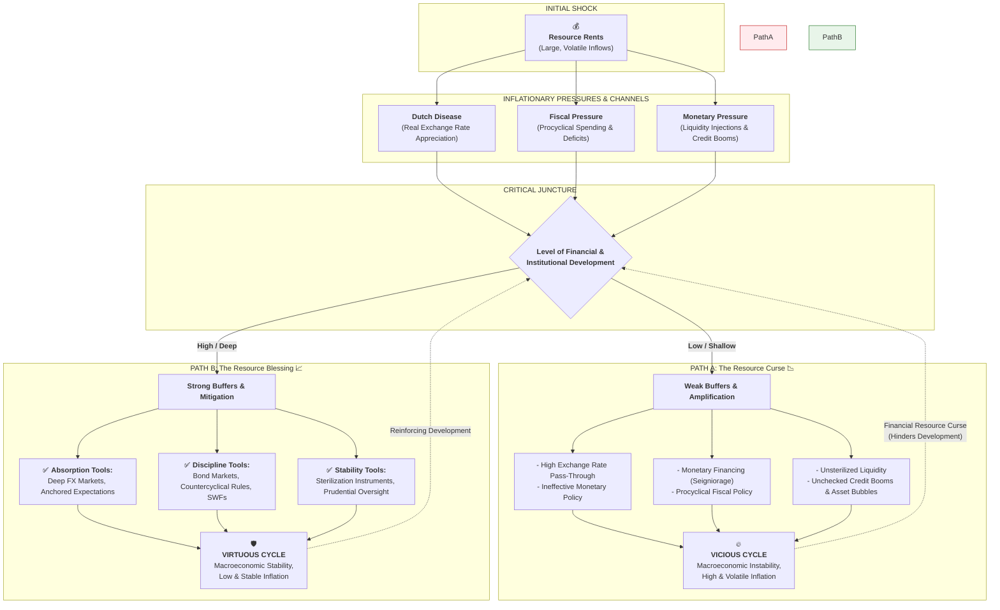

```mermaid
graph TD
    subgraph "INITIAL SHOCK"
        A["💰<br><b>Resource Rents</b><br>(Large, Volatile Inflows)"]
    end

    subgraph "INFLATIONARY PRESSURES & CHANNELS"
        B1["<b>Dutch Disease</b><br>(Real Exchange Rate Appreciation)"]
        B2["<b>Fiscal Pressure</b><br>(Procyclical Spending & Deficits)"]
        B3["<b>Monetary Pressure</b><br>(Liquidity Injections & Credit Booms)"]
    end
    
    subgraph "CRITICAL JUNCTURE"
        C{"<b>Level of Financial &<br>Institutional Development</b>"}
    end

    A --> B1 & B2 & B3 --> C

    subgraph "PATH A: The Resource Curse 📉"
        style PathA fill:#ffebee,stroke:#c62828
        C --"<b>Low / Shallow</b>"--> D["<b>Weak Buffers & Amplification</b>"]
        D --> D1["- High Exchange Rate Pass-Through<br>- Ineffective Monetary Policy"]
        D --> D2["- Monetary Financing (Seigniorage)<br>- Procyclical Fiscal Policy"]
        D --> D3["- Unsterilized Liquidity<br>- Unchecked Credit Booms & Asset Bubbles"]
        D1 & D2 & D3 --> E1["🔥<br><b>VICIOUS CYCLE</b><br>Macroeconomic Instability,<br>High & Volatile Inflation"]
    end

    subgraph "PATH B: The Resource Blessing 📈"
        style PathB fill:#e8f5e9,stroke:#2e7d32
        C --"<b>High / Deep</b>"--> F["<b>Strong Buffers & Mitigation</b>"]
        F --> F1["✅ <b>Absorption Tools:</b><br>Deep FX Markets, Anchored Expectations"]
        F --> F2["✅ <b>Discipline Tools:</b><br>Bond Markets, Countercyclical Rules, SWFs"]
        F --> F3["✅ <b>Stability Tools:</b><br>Sterilization Instruments, Prudential Oversight"]
        F1 & F2 & F3 --> E2["🛡️<br><b>VIRTUOUS CYCLE</b><br>Macroeconomic Stability,<br>Low & Stable Inflation"]
    end

    E1 -.->|"Financial Resource Curse<br>(Hinders Development)"| C
    E2 -.->|"Reinforcing Development"| C
```
